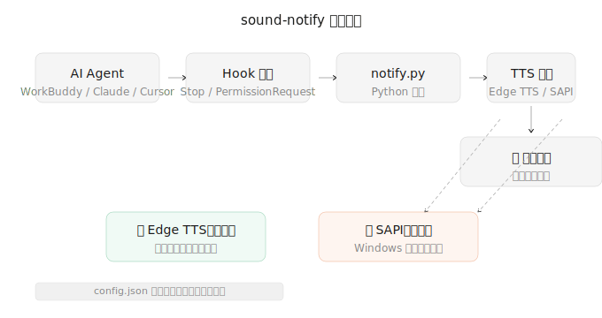
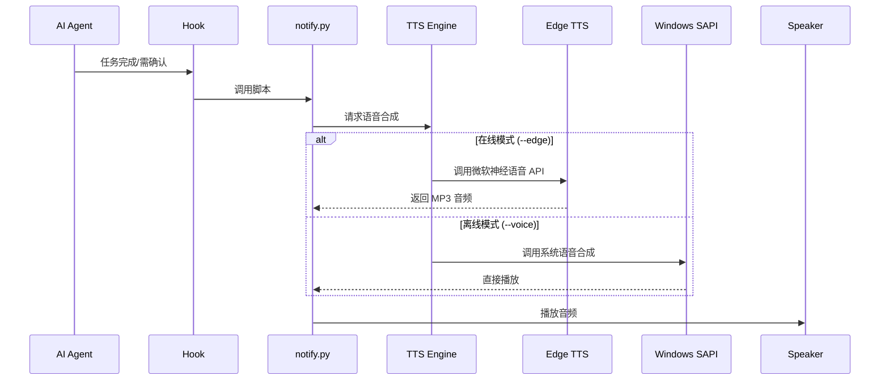

# sound-notify

🔊 Sound Notify — 通用 AI Agent 声音提醒工具 (Windows, Python, 离线/在线双引擎)

[](LICENSE)
[](https://www.microsoft.com/windows)
[](https://www.python.org)

## 🖼️ 工作流程



## ✨ 功能特点

| 功能 | 说明 |
|------|------|
| **🔊 人声播报** | 任务完成/需确认时使用 TTS 语音提醒，比系统提示音更自然 |
| **⚡ 双引擎** | Edge TTS（在线神经语音）/ Windows SAPI（离线） |
| **🌍 多语言** | 内置 `zh-CN` 和 `en-US` 两种语言包 |
| **📋 6 种事件** | done / daily / confirm / perm / alert / thinking |
| **⚙️ 零依赖** | 纯 Python + winsound，开箱即用 |
| **📝 可配置** | 通过 `config.json` 自定义播报文案，无需改代码 |

## 🚀 快速开始

### 1. 安装

```bash
# 下载脚本
curl -O https://raw.githubusercontent.com/gabrielbing/sound-notify/main/scripts/notify.py

# 安装 Edge TTS（推荐，音质更好）
pip install edge-tts
```

### 2. 测试

```bash
# 使用 Edge TTS（需联网）
python notify.py test --edge

# 使用 Windows SAPI（离线）
python notify.py test --voice
```

## 📦 安装到各类 AI Agent

### WorkBuddy

下载 `sound-notify.zip`，在 WorkBuddy 技能页面上传即可。

### Claude Code / Cursor / 其他 Agent

在 Hook 配置中调用 `notify.py`：

```json
{
  "Stop": [{
    "matcher": "*",
    "hooks": [{
      "type": "command",
      "command": "python C:/path/to/notify.py done --edge"
    }]
  }]
}
```

## 🎯 支持的事件

| 事件 | 参数 | 默认播报（中文） | 使用场景 |
|------|------|----------------|---------|
| 任务完成 | `done` | 搞定了，任务已完成。 | AI 完成任务时 |
| 每日推送 | `daily` | 今日推送已就绪，来看看吧。 | 定时提醒 |
| 待确认 | `confirm` | 需要你确认一下。 | 等待用户确认 |
| 权限请求 | `perm` | 需要你的授权才能继续。 | 需要授权时 |
| 紧急提醒 | `alert` | 请注意，一条重要的提醒。 | 重要通知 |
| 处理中 | `thinking` | 正在处理中，请稍候。 | 长时间任务 |

## ⚙️ 自定义配置（无需改代码）

通过 JSON 配置文件，可以随意修改播报文案、默认语音、缓存目录，**完全不用改 `notify.py` 代码**。

### 生成示例配置

```bash
python scripts/notify.py --generate-config
# 生成到: ~/.sound-notify/config.json
```

### 配置文件格式

```json
{
  "default_voice": "zh-CN-YunxiNeural",
  "cache_dir": "~/.sound-notify/cache",
  "events": {
    "done":    { "voice": "✅ 任务搞定啦！" },
    "confirm":  { "voice": "⚠️ 等您确认哦～" },
    "perm":     { "voice": "🔐 需要授权才能继续" }
  }
}
```

### 使用配置文件

```bash
# 使用默认路径 (~/.sound-notify/config.json)
python scripts/notify.py done --edge

# 使用指定路径
python scripts/notify.py --config /path/to/my-config.json done --edge
```

> 💡 配置文件支持 emoji！让播报更有趣 😄

### 多语言支持

通过 `--lang` 参数或配置文件中的 `"language"` 字段切换语言：

```bash
# 中文播报（默认）
python scripts/notify.py done --edge

# 英文播报
python scripts/notify.py done --edge --lang en-US
```

在 `config.json` 中设置默认语言：

```json
{
  "language": "en-US",
  "events": {
    "done": { "voice": "Job's done!" }
  }
}
```

内置语言包：

| 语言代码 | 语言 | 默认语音 |
|---------|------|---------|
| `zh-CN` | 中文 | 云希 (温柔男声) |
| `en-US` | English | Yunxi (warm male) |

## 📖 命令行完整用法

```
用法: notify.py <事件> [选项]

位置参数:
  <事件>        done / daily / confirm / perm / alert / thinking / test / list

选项:
  --edge, -e              使用 Edge TTS 在线人声（推荐）
  --voice, -v             使用 Windows SAPI 离线人声
  --voice-name NAME        指定 TTS 语音（如 zh-CN-YunyangNeural）
  --lang LANG             语言: zh-CN (默认) / en-US
  --rate N                语速调节（正数加快，负数减慢）
  --loop N                重复播放 N 次
  --interval SEC          重复间隔（秒）
  --list-voices           列出所有可用语音
  --no-cache              清理缓存并强制重新生成
  --config PATH           指定 JSON 配置文件路径
  --generate-config       生成示例配置文件
```

## 🌟 可选语音列表

| 编号 | 语音代码 | 名称 | 性别 | 风格 |
|------|----------|------|------|------|
| 1 | zh-CN-YunxiNeural | 云希 | 男 | 温柔阳光（默认） |
| 2 | zh-CN-YunyangNeural | 云扬 | 男 | 沉稳大气 |
| 3 | zh-CN-YunyeNeural | 云野 | 男 | 轻松自然 |
| 4 | zh-CN-YunhuNeural | 云虎 | 男 | 活力充沛 |
| 5 | zh-CN-XiaoxiaoNeural | 晓晓 | 女 | 温柔甜美 |
| 6 | zh-CN-XiaoyiNeural | 晓依 | 女 | 清澈灵动 |
| 7 | zh-CN-XiaochenNeural | 晓辰 | 女 | 知性优雅 |
| 8 | zh-CN-XiaomengNeural | 晓梦 | 女 | 俏皮可爱 |

## 🔧 工作原理



## 🔍 故障排查

| 问题 | 解决方案 |
|------|---------|
| Edge TTS 报错 | 检查网络连接，或改用 `--voice` 离线模式 |
| SAPI 没有声音 | 检查 Windows 语音合成设置，选择"Microsoft Huihui..." |
| 权限错误 | 以管理员身份运行命令行 |
| 缓存占用空间 | 使用 `--no-cache` 参数清理 |

## 📄 License

MIT License — 自由使用、修改、分发。详见 [LICENSE](LICENSE) 文件。

---

⭐ 如果这个项目对你有帮助，欢迎 Star 支持！
