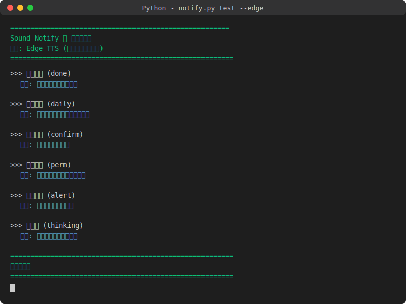

# 🔊 Sound Notify

> A zero-dependency sound notification script for Windows — uses human voice to remind you when tasks complete, confirmation needed, or permission requested.

[](https://www.python.org/)
[]()
[](LICENSE)

<p align="center">
  <b>✨ Works with any AI Agent platform</b> · WorkBuddy · Claude Code · Cursor · Windsurf · Copilot
</p>

---

## 🎯 What it does

Automatically plays human voice notifications when your AI Agent completes tasks, needs confirmation, or requests permissions. No more staring at the screen waiting for results.

| Event | Trigger Scene | Voice Message |
|-------|--------------|---------------|
| `done` | Task completed | "Done! Task completed." |
| `confirm` | Confirmation needed | "Please confirm." |
| `perm` | Permission requested | "Need your authorization to continue." |
| `alert` | Urgent alert | "Attention, an urgent reminder." |
| `daily` | Daily push | "Your daily briefing is ready." |
| `thinking` | Thinking timeout | "Still processing, please wait." |

---

## 🎤 Voice Engines

| Engine | Quality | Network | Install Needed |
|--------|----------|---------|----------------|
| **Edge TTS** ⭐ | Neural, natural | First time only | `pip install edge-tts` |
| **SAPI** | System built-in | No | None (Windows only) |
| **macOS TTS** | System built-in | No | None (macOS only) |
| **Linux TTS** | espeak/speech-dispatcher | No | `sudo apt install espeak` |

Default: **Edge TTS + Yunxi** (warm male voice), supports 8 Chinese voices with easy switching. Cross-platform support for Windows/macOS/Linux.

---

## 🚀 Quick Start

### 1. Install

```bash
# Install online voice engine (recommended, better quality)
pip install edge-tts

# Or use offline mode directly (no dependencies needed)
```

### 2. Test

```bash
# Online voice test
python scripts/notify.py test --edge

# Offline voice test (Windows: SAPI, macOS: say, Linux: espeak)
python scripts/notify.py test --voice
```

**Terminal output example:**



### 3. Usage

```bash
python scripts/notify.py done --edge     # Task completed
python scripts/notify.py confirm --edge  # Confirmation needed
python scripts/notify.py perm --edge     # Permission requested
```

---

## ⚙️ Custom Configuration (No Code Changes)

Using JSON config file, you can modify voice messages, default voice, cache directory **without touching `notify.py` code**.

### Generate Example Config

```bash
python scripts/notify.py --generate-config
# Generates to: ~/.sound-notify/config.json
```

### Config File Format

```json
{
  "default_voice": "zh-CN-YunxiNeural",
  "cache_dir": "~/.sound-notify/cache",
  "events": {
    "done":    { "voice": "✅ Task completed!" },
    "confirm":  { "voice": "⚠️ Waiting for your confirmation~" },
    "perm":     { "voice": "🔐 Need authorization to continue" },
    "alert":    { "voice": "🚨 Urgent alert!" },
    "daily":    { "voice": "☀️ Today's briefing is ready" },
    "thinking": { "voice": "⏳ Please wait, processing" }
  }
}
```

### Use Config File

```bash
# Use default path (~/.sound-notify/config.json)
python scripts/notify.py done --edge

# Use specified path
python scripts/notify.py --config /path/to/my-config.json done --edge
```

> 💡 Config file supports emoji! Make notifications more fun 😄

### Multi-language Support

Switch language via `--lang` parameter or `"language"` field in config file:

```bash
# Chinese (default)
python scripts/notify.py done --edge

# English
python scripts/notify.py done --edge --lang en-US
```

Set default language in `config.json`:

```json
{
  "language": "en-US",
  "events": {
    "done": { "voice": "Job's done!" }
  }
}
```

Built-in language packs:

| Language Code | Language | Default Voice |
|---------------|----------|---------------|
| `zh-CN` | 中文 | 云希 (warm male) |
| `en-US` | English | Yunxi (warm male) |

---

## 📦 Install to AI Agents

### WorkBuddy

Upload `sound-notify.zip` to the skills page, ready to use out of the box.

### Claude Code / Cursor / Windsurf / Any Agent

Can be called anywhere that can execute shell commands:

```bash
python /path/to/scripts/notify.py done --edge
```

In your Agent config, bind these events:

| Hook Event | Command |
|------------|---------|
| Task completed / Stop | `python notify.py done --edge` |
| Permission requested | `python notify.py perm --edge` |
| Confirmation needed | `python notify.py confirm --edge` |

### As Python Module

```python
from notify import play_voice, play_beep_then_voice

play_voice("done")                   # Offline voice
play_beep_then_voice("perm", engine="edge")  # Online voice
```

---

## 🎛️ Command Line Usage

```
python scripts/notify.py <event> [options]

Events:
  done       Task completed
  confirm    Confirmation needed
  perm       Permission requested
  alert      Urgent alert
  daily      Daily push
  thinking   Processing
  test       Test all sounds
  list       List all events

Options:
  --edge, -e              Use Edge TTS online voice (recommended)
  --voice, -v             Use system TTS offline voice
  --voice-name NAME        Specify TTS voice (e.g., zh-CN-YunyangNeural)
  --lang LANG             Language: zh-CN (default) / en-US
  --rate N                 Speech rate (positive = faster, negative = slower)
  --loop N                 Repeat N times
  --interval SEC           Repeat interval (seconds)
  --list-voices            List all available voices
  --no-cache               Clear cache and force regenerate
  --config PATH            Specify JSON config file path
  --generate-config        Generate example config file
```

---

## 🗣️ Voice List

### Male Voices

| ID | Name | Style |
|----|------|-------|
| `zh-CN-YunxiNeural` ⭐ | Yunxi | Warm & sunny (default) |
| `zh-CN-YunyangNeural` | Yunyang | Professional & reliable |
| `zh-CN-YunjianNeural` | Yunjian | Energetic & passionate |
| `zh-CN-YunxiaNeural` | Yunxia | Cute teenager |

### Female Voices

| ID | Name | Style |
|----|------|-------|
| `zh-CN-XiaoxiaoNeural` | Xiaoxiao | Warm & intellectual |
| `zh-CN-XiaoyiNeural` | Xiaoyi | Lively & vivid |
| `zh-CN-XiaohanNeural` | Xiaohan | Gentle & quiet |
| `zh-CN-XiaomoNeural` | Xiaomo | Mature & intellectual |

Switch voice:

```bash
python scripts/notify.py done --edge --voice-name zh-CN-YunyangNeural
```

---

## 🧠 How it Works

```
User/AI Trigger → notify.py receives event
                     ↓
          ┌──────────┼──────────┐
          ↓          ↓          ↓
      Edge TTS    System TTS    Beep
     (online)    (offline)    (simple)
          ↓          ↓          ↓
        MP3 / WAV → Play → 🔈 Sound
```

- **Edge TTS**: First playback generates audio online (~1 sec), then caches for instant playback
- **System TTS**: Calls built-in voice engine (SAPI on Windows, say on macOS, espeak on Linux), fully offline
- **Cache**: `~/.sound-notify/cache/` directory, stored by text+voice hash

---

## 📋 System Requirements

| Item | Minimum Requirement |
|------|-------------------|
| OS | Windows / macOS / Linux |
| Python | 3.6+ |
| Network | Needed for Edge TTS mode, not for system TTS |
| macOS/Linux | Requires system TTS (built-in or espeak) |

> 💡 Windows users can use `--voice` for offline mode (SAPI). macOS/Linux users use built-in TTS or espeak.

---

## 🔧 Troubleshooting

| Problem | Solution |
|---------|-----------|
| Can't hear voice | Confirm edge-tts installed: `pip install edge-tts` |
| First playback slow | Normal, first time needs network, then cached |
| edge-tts command not found | Check Python Scripts dir in PATH |
| Want default beep | Don't use `--edge`, use system beep or TTS |
| macOS: no sound | Check if `say` command works: `say "test"` |
| Linux: no sound | Install espeak: `sudo apt install espeak` |

---

## 🤝 Contributing

Issues and Pull Requests welcome!

If you want to add new voices, new event types, or improve cross-platform support, please open an Issue first to discuss.

---

## 📄 License

[MIT License](LICENSE) — Free to use, modify, and distribute.

---

## ⭐ Star History

If this project helps you, please give it a Star ⭐

---

<p align="center">
  Made with ❤️ for AI Agent users
</p>
